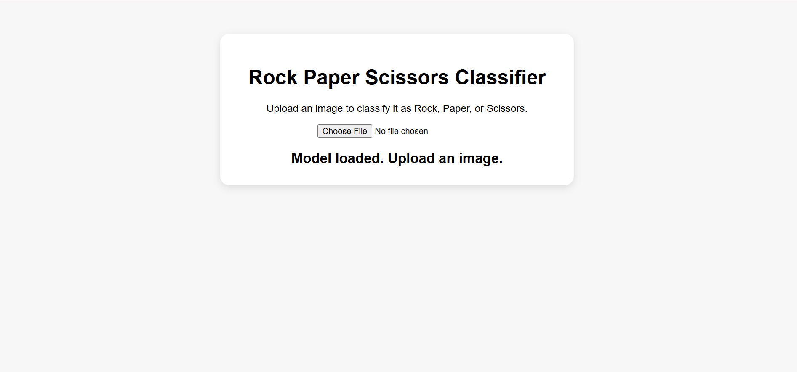
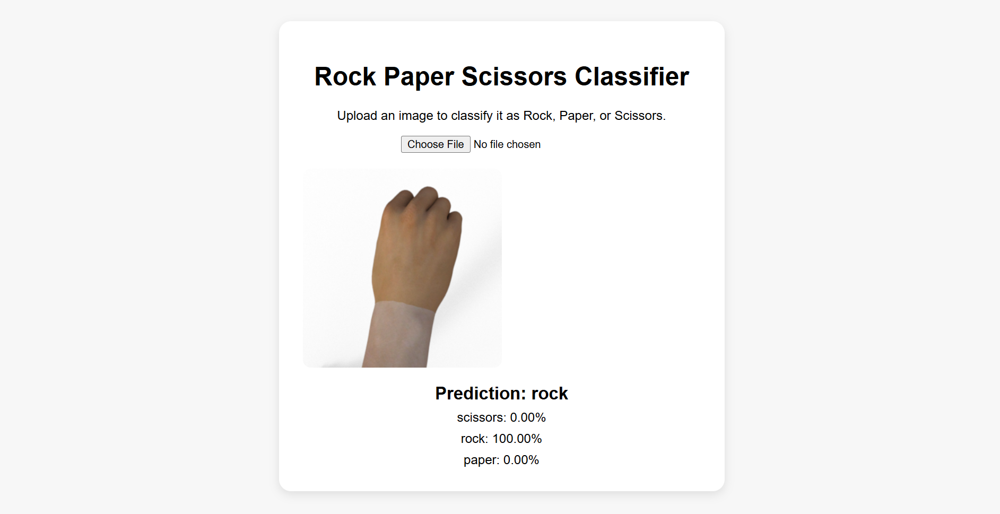

# 🪨✋✌️ Rock Paper Scissors Image Classifier

<p align="center">
  
</p>

An interactive image classification project that predicts whether an uploaded hand gesture image represents **Rock**, **Paper**, or **Scissors**.

The model was trained using **Google Teachable Machine**, tested in **Google Colab**, and deployed as a simple browser-based web application using **TensorFlow.js** and **GitHub Pages**.

---

## 🔗 Live Demo

Try the project here:

https://feton-alberekit.github.io/rock-paper-scissors-web/

---

## 📌 Project Overview

This project demonstrates a simple and practical image classification workflow.

The main goal is to classify hand gesture images into three categories:

- Rock
- Paper
- Scissors

The model was trained using Google Teachable Machine by uploading image data for each class. After training, the model was exported and tested in Google Colab by uploading a sample image and checking the prediction result.

To make the project more accessible, the model was also deployed as a web application. The web version allows users to upload an image directly from their device and receive a prediction through the browser.

---

## 🎯 Project Objective

The objective of this project is to build a beginner-friendly image classification model and present it in a professional way through:

- A trained image classification model
- A Google Colab testing workflow
- A simple interactive web interface
- A public GitHub Pages deployment
- A clear and organized GitHub repository

---

## 🧠 Classes

The model classifies hand gesture images into three classes:

| Class | Description |
|------|-------------|
| 🪨 Rock | Closed fist hand gesture |
| ✋ Paper | Open hand gesture |
| ✌️ Scissors | Two-finger hand gesture |

---

## 🛠️ Technologies Used

- Google Teachable Machine
- TensorFlow / Keras
- TensorFlow.js
- Google Colab
- HTML
- CSS
- JavaScript
- GitHub
- GitHub Pages

---

## 🔄 Project Workflow

The project followed this workflow:

1. Downloaded a Rock, Paper, Scissors image dataset.
2. Uploaded the images into Google Teachable Machine.
3. Created three classes: Rock, Paper, and Scissors.
4. Trained the image classification model.
5. Exported the trained model in TensorFlow/Keras format.
6. Tested the model in Google Colab by uploading a sample image.
7. Prepared the model for web deployment using TensorFlow.js format.
8. Built a simple web page for image upload and prediction display.
9. Deployed the project using GitHub Pages.
10. Added a small dataset sample and screenshots for documentation.

---

## 📂 Dataset

The dataset contains images of three hand gestures:

- Rock
- Paper
- Scissors

A small sample of the dataset is included in this repository for demonstration purposes.  
The sample contains **5 images from each class**.

```text
dataset_sample/
├── rock/
├── paper/
└── scissors/
```

The full training process was done using Google Teachable Machine.  
The included sample dataset is only provided to show the type of images used in the project without making the repository too large.

---

## 🤖 Model

The model was trained using Google Teachable Machine.

Two model formats were used during the project:

### 1. TensorFlow/Keras Format

This format was used for testing the trained model in Google Colab.

The testing process included:

- Loading the trained model
- Uploading a test image
- Running prediction
- Displaying the predicted class

### 2. TensorFlow.js Format

This format was used for the web application.

The TensorFlow.js model files are stored in the `model` folder:

```text
model/
├── model.json
├── metadata.json
└── weights.bin
```

These files allow the model to run directly inside the browser.

---

## 🌐 Web Application

The web application allows users to:

- Upload an image from their device
- Preview the uploaded image
- Run prediction using the trained model
- Display the predicted class
- Show confidence scores for each class

The website runs directly in the browser using TensorFlow.js, without requiring a backend server.

---

## 🗂️ Repository Structure

```text
rock-paper-scissors-web/
│
├── index.html
├── README.md
│
├── model/
│   ├── model.json
│   ├── metadata.json
│   └── weights.bin
│
├── dataset_sample/
│   ├── rock/
│   ├── paper/
│   └── scissors/
│
└── screenshots/
    ├── website.png
    └── prediction_result.png
```

---

## 🚀 How to Use the Web App

1. Open the live demo link.
2. Click **Choose File**.
3. Upload an image of a hand gesture.
4. The model will predict whether the image is Rock, Paper, or Scissors.
5. The prediction result and confidence scores will be displayed on the page.

Live Demo:

```text
https://feton-alberekit.github.io/rock-paper-scissors-web/
```

---

## 💻 How to Run Locally

To run the project locally:

1. Download or clone the repository.

```bash
git clone https://github.com/feton-alberekit/rock-paper-scissors-web.git
```

2. Open the project folder.

3. Run `index.html` using a local server.

For example, if you are using VS Code:

1. Install the **Live Server** extension.
2. Open the project folder in VS Code.
3. Right-click on `index.html`.
4. Select **Open with Live Server**.

---

## 📊 Example Output

When an image is uploaded, the model returns a prediction similar to:

```text
Prediction: rock

scissors: 0.00%
rock: 100.00%
paper: 0.00%
```

---

## 🖼️ Screenshots

### Website Interface

<p align="center">
  
</p>

### Prediction Result

<p align="center">
  
</p>

---

## ✅ Project Value

This project shows how a simple machine learning idea can be turned into a complete and shareable project.

The project covers the following stages:

```text
Dataset → Training → Model Export → Testing → Web Deployment → Documentation
```

Although the model was trained using a beginner-friendly tool, the project demonstrates an important practical workflow: moving from a trained model to a usable web application.

This makes the project a good introduction to image classification and basic machine learning deployment.

---

## 🔍 Limitations

This project is a beginner-level image classification project, so it has some limitations:

- The model was trained using Google Teachable Machine, not a custom CNN built from scratch.
- The model may perform better on images similar to the training data.
- Accuracy may decrease with different lighting, backgrounds, or hand positions.
- The dataset sample included in the repository is small and used only for demonstration.
- No detailed evaluation report, confusion matrix, or accuracy analysis was created yet.

---

## 🌱 Future Improvements

Possible improvements for future versions include:

- Adding webcam-based live prediction
- Improving the website design
- Adding drag-and-drop image upload
- Showing confidence scores as visual progress bars
- Testing the model on more diverse images
- Adding more hand gesture classes
- Creating a simple model evaluation report
- Adding a confusion matrix and accuracy summary
